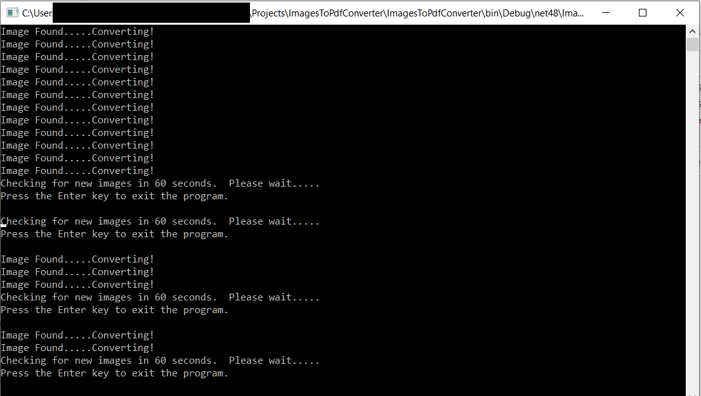

Converts Images to PDF's - C# .Net 4.8 Console Application
==========================================================

I wrote this image to pdf converter as I needed a tool that could monitor a folder for images and then convert them as they come in.
It uses the PdfSharp Opensource Framework.

Currently it is set to check the folder for any new images every 60 seconds.
Once an image is found, it will convert it to a pdf and move the original image to a backup folder.
The pdf page size is set to the same size as the image, so at times when you open the pdf,
it will be zoomed in over 100%.  When zooming out, the pdf should look exatly like the image.

Current Image formats supported and tested: ["bmp", "gif", "png", "jpeg", "jpg", "tiff"]
Some .tiff and .gif fail, not sure why, looks image data related.

Folder Locations Used by this service
--------------------------------------
ImageSource(To Monitor):  .\ConvertToPdf\ImagesToConvert
Saved Pdf location:  .\ConvertToPdf\Converted
Backup Folder:  .\ConvertToPdf\ImageBackups

If an image fails to convert, it will be backed up and deleted from the monitor folder to prevent the service getting stuck in a loop.
If there was a failure, the service will resume converting the rest of the images in the next run.

--------------------------------------------
Work in progress.  Might be one or two bugs.
--------------------------------------------

